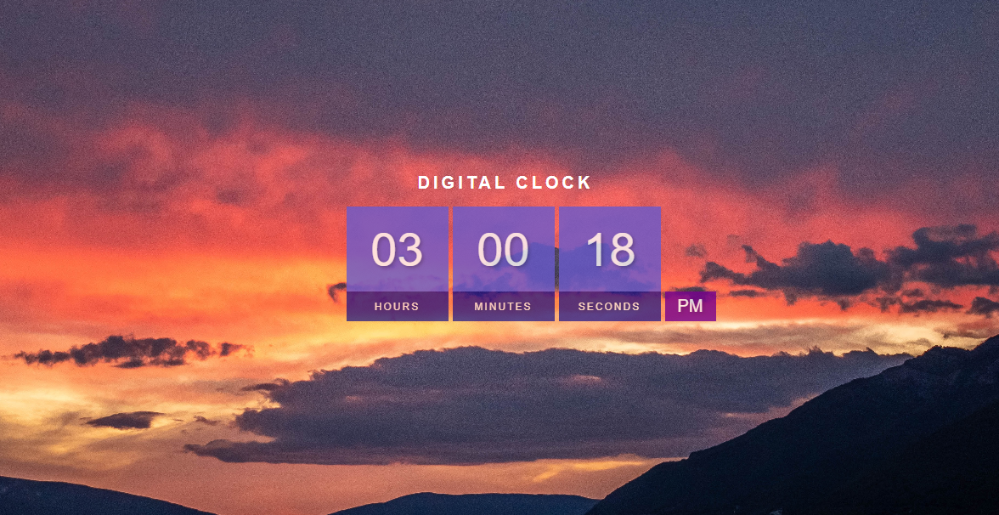

# digital-clock

## Visão Geral

### Projeto de uma aplicação Web que mostra o horário de acordo sua localização.
#




#
## Construido com:
- HTML
- CSS
- JavaScript

## Funcionalidades
- Mostra o horário, de acordo a localização configurada em seu PC.

## O que eu aprendi:
- Propriedade DateConstructor
```js
    let hour = new Date().getHours()
```
- Operadores ternários no JS
  - Funciona como a função " if "
```js
      hour = hour < 10 ? '0' + hour : hour;
```
- Função setTimeout
```js
    setTimeout(() => {updateClock()}, 1000)
```

## Link

Veja o projeto aqui: [Acessar🌍](https://devhiderlan.github.io/digital-clock/)

## Autor

Hiderlan Santana: [Linkedin](https://www.linkedin.com/in/hiderlan-santana/)